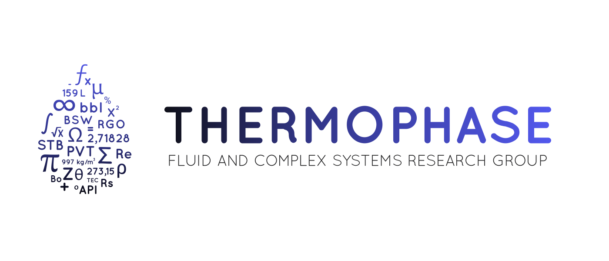

# thermoml-io

[](https://github.com/ThermoPhase-FCSRG/thermoml-io/actions/workflows/tests.yml)
[](https://codecov.io/gh/ThermoPhase-FCSRG/thermoml-io)
[](https://github.com/ThermoPhase-FCSRG/thermoml-io/actions/workflows/tests.yml)
[](https://thermophase-fcsrg.github.io/thermoml-io/)
[](https://pypi.org/project/thermoml-io/)
[](https://pypi.org/project/thermoml-io/)
[](LICENSE)

**ThermoML in, analysis-ready tables out — with the publication, experimental
conditions, and uncertainties kept alongside every value.**

> [!IMPORTANT]
> **Data source and attribution.** `thermoml-io` is an independent Python
> library for accessing, downloading, parsing, searching, and exporting data
> from the
> [NIST Thermodynamics Research Center (TRC) ThermoML Archive](https://www.nist.gov/mml/acmd/trc/thermoml/thermoml-archive).
> The archive contains ThermoML files prepared through cooperation between
> NIST/TRC and participating journal publishers. `thermoml-io` is not
> affiliated with, sponsored by, or endorsed by NIST, IUPAC, or those
> publishers. The software does not redistribute the archive; downloaded data
> remain subject to their source terms and citation requirements.

`thermoml-io` is a typed client and analysis library for experimental data
distributed through the NIST/TRC ThermoML Archive in the IUPAC ThermoML format.
It is aimed at researchers who need reusable thermophysical datasets without
losing the context required to interpret or cite them correctly. Its parser can
also read other conforming ThermoML documents supplied by the user.

With `thermoml-io`, you can:

- search by familiar component names such as `"water"`, formulas such as
  `"CO2"`, or stable identifiers such as CAS numbers and InChIKeys;
- select a property and the condition against which it was measured, such as
  viscosity versus pressure or density versus temperature;
- restrict searches to exact systems or allow additional components;
- rank datasets or publications by the number of matching observations;
- retain publication, sample, method, phase, constraint, significant-digit,
  and uncertainty metadata;
- read both the official NIST XML and JSON representations, with auditable
  recovery from a malformed XML only when its paired official JSON exists;
- generate APA citations, BibTeX entries, and compact authors-year labels; and
- export consistent tables to CSV, JSON, YAML, or Parquet.

The package is an original implementation of the public IUPAC ThermoML
standard. `fetch_thermoml_archive()` retrieves the checksum-pinned archive
directly from the official
[NIST Public Data Repository](https://data.nist.gov/od/id/mds2-2422) into a
user-controlled cache; no NIST archive or publisher data are included in the
Python distributions.

## Installation

Install the core parser and search API:

```bash
pip install thermoml-io
```

Install all tabular exporters and pandas integration:

```bash
pip install "thermoml-io[export,pandas]"
```

## Quick start: one publication

The following example reads a public ThermoML document and creates the complete
provenance representation used by the parser:

```python
from thermoml_io import (
    ThermoMLCollection,
    build_experimental_table,
    load_thermoml_url,
)

document = load_thermoml_url(
    "https://trc.nist.gov/ThermoML/10.1016/j.fluid.2014.11.015.xml"
)
collection = ThermoMLCollection((document,))

matches = collection.search(
    system=("water", "carbon dioxide", "ammonia"),
    data_type="VLE",
    limit=10,
)

table = build_experimental_table(collection, matches=matches)
table.write("results-lossless.json")
```

The JSON representation is also a first-class input:

```python
from thermoml_io import load_thermoml_json_url

document = load_thermoml_json_url(
    "https://trc.nist.gov/ThermoML/10.1016/j.fluid.2015.07.026.json"
)
```

`load_thermoml_url()` follows the same XML-first rule: an official `.xml` URL
is parsed normally and its same-path `.json` URL is requested only if XML
parsing fails. The returned provenance identifies both attempts.

For the bulk NIST snapshot, XML remains authoritative whenever it parses. If
an XML member is malformed, the default `json_fallback="on_xml_error"` uses
only the same-path official `.json` member. `result.recoveries` reports every
such event; no recovery is silent. Set `json_fallback="never"` for an XML-only
census. JSON numbers are parsed without a binary floating-point round trip,
but JSON may not retain the exact decimal spelling found in the related XML;
this caveat is stored in `document.warnings` and in recovery provenance.

Component order does not matter. Because `system=` uses exact matching by
default, a dataset containing a fourth component is not selected. Results are
ranked by their number of matching property observations before `limit` is
applied.

For analysis-ready property/condition CSV files, use the query workflow below.
The lossless representation is deliberately more detailed and is intended for
auditing or building other derived views.

## Search the complete ThermoML Archive

The package knows where to retrieve the configured upstream archive, so no
archive URL or checksum is required:

```python
from thermoml_io import fetch_thermoml_archive, query_thermoml_archive

archive = fetch_thermoml_archive()

result = query_thermoml_archive(
    archive,
    components="H2",
    component_match="contains",
    data_category="transport",
    property_name="viscosity",
    independent_variable="pressure",
    publication_limit=10,
)

result.write_csv("h2-viscosity-vs-pressure.csv")
```

The CSV contains ordinary scientific columns rather than the internal
ThermoML structure. A typical header is:

```text
"Temperature, K","Pressure, kPa","Viscosity, Pa*s",DOI,Authors/Year,System,...,metadata
```

Each row is one reported viscosity observation. Complementary conditions are
promoted to physical columns whenever possible; the compact `metadata` JSON
field retains uncertainties, significant digits, samples, devices, APA and
BibTeX citations, source checksum, and the complete condition descriptors.

This query:

1. finds systems containing molecular hydrogen, including mixtures;
2. keeps transport-property datasets reporting viscosity versus pressure;
3. ranks publications by the number of matching property-pressure pairs;
4. retains only the ten densest publications; and
5. writes the measurements as physical columns, with citation and experimental
   metadata attached to every row.

Use `component_match="exact"` when no additional components should be present.
For a CO2 + water search that permits higher-order mixtures:

```python
result = query_thermoml_archive(
    archive,
    components=("CO2", "water"),
    component_match="contains",
    data_category="volumetric",
    property_name="density",
    independent_variable="temperature",
    publication_limit=10,
)

result.write_csv("co2-water-density-vs-temperature.csv")
```

Each property-condition query produces its own table. For example, viscosity
versus pressure and viscosity versus temperature should remain separate CSVs
because they represent different experimental relationships.

## Friendly component identifiers

Use the most readable identifier that unambiguously describes the component.
Search is case-insensitive and resolves aliases across the complete collection
or archive before selecting datasets:

```python
components="hydrogen"                           # reported common name
components="molecular hydrogen"                 # reported IUPAC name
components="H2"                                 # molecular formula
components="1333-74-0"                          # CAS Registry Number
components="InChI=1S/H2/h1H"                    # standard InChI
components="UFHFLCQGNIYNRP-UHFFFAOYSA-N"        # standard InChIKey
```

Names and formulas make exploratory work easier, but they are not universally
unique. For example, `C4H10` does not distinguish n-butane from isobutane.
Prefer a CAS number, standard InChI, or InChIKey whenever stereochemistry,
isomerism, charge, or isotopic composition could make a name or formula
ambiguous.

Matching is intentionally exact after whitespace normalization: the package
does not silently guess a chemical identity from a partial name. If the same
name or formula maps to distinct structural identifiers, the query raises
`AmbiguousComponentError` and lists the candidates.

Identifier prefixes make the intended namespace explicit:

```python
collection.resolve_component("name:water")
collection.resolve_component("formula:H2O")
collection.resolve_component("cas:7732-18-5")
collection.resolve_component("inchikey:XLYOFNOQVPJJNP-UHFFFAOYSA-N")
```

For repeated full-archive queries, build the local component index once:

```python
from thermoml_io import index_thermoml_archive, query_thermoml_archive

components = index_thermoml_archive(archive)
h2 = components.resolve_component("hydrogen")

result = query_thermoml_archive(
    archive,
    components=h2,
    data_category="transport",
    property_name="viscosity",
    independent_variable="pressure",
)
```

The local index uses only metadata reported by ThermoML. An optional PubChem
lookup is available when external name resolution is useful, but it is always
called explicitly:

```python
from thermoml_io import resolve_pubchem_component

h2 = resolve_pubchem_component("molecular hydrogen")
result = query_thermoml_archive(
    archive,
    components=h2,
    data_category="transport",
    property_name="viscosity",
    independent_variable="pressure",
)
```

Ordinary ThermoML parsing and search never contact PubChem. The returned
`ComponentIdentity` is detached enrichment metadata; it does not alter the
compound information reported by the source publication.

## Analysis-ready exports

Query results export the analysis-ready layout by default. The output format is
inferred from the filename:

```python
result.write("results.csv")
result.write("results.json")
result.write("results.yaml")
result.write("results.parquet")
```

You can also move directly into a pandas workflow:

```python
frame = result.analysis_table.to_pandas()
```

The lossless internal table remains available explicitly when an audit or a
custom transformation needs every original structural field:

```python
result.table.to_pandas()
result.write_lossless("results-lossless.parquet")
```

CSV and JSON are available from the core installation. YAML, Parquet, and
pandas use the corresponding optional dependencies.

## What is preserved

The typed data model keeps the information needed to audit and reuse a result:

- publication title, authors, year, DOI, journal, APA citation, and BibTeX;
- source locator, retrieval timestamp, and SHA-256 digest;
- source media type, related XML checksum, and complete fallback provenance;
- compound identifiers, samples, sources, purification, and purity;
- property and variable definitions, units, phases, and component references;
- experimental methods and devices;
- fixed and complementary conditions;
- significant digits, repeatability, and reported uncertainties; and
- the original ThermoML classifications alongside convenient derived
  categories such as VLE, LLE, SLE, transport, and volumetric data.

## Archive coverage and updates

The configured bulk snapshot contains the official NIST/TRC series through the
2019 publication year; it is not limited to 2019–2020 records. Its 11,923 XML
documents have paired JSON representations. The default recovery path makes
the two currently malformed XML serializations usable from their official
JSON counterparts while preserving both source identities and hashes.

The archive source is stored in a checksum-pinned package registry. A monthly
GitHub Actions workflow compares both the NERDm bulk record and the complete
live Cordra ID census. The Cordra monitor hashes the sorted identifiers, so it
can detect additions or removals even when no new `.tgz` is published. Changes
open a reviewable, metadata-only pull request.

The IUPAC ThermoML 4.0 supplementary schema and 14 use cases are registered
separately as an external conformance corpus. They are never mixed into NIST
experimental searches, downloaded automatically, or redistributed. Users may
also parse their own ThermoML XML/JSON files and archives; those inputs remain
outside the package.

Downloaded XML and user-generated data tables remain local. They are not
included in wheels, source distributions, tests, documentation, or the source
repository.

## Examples and notebooks

The paired Jupyter/Jupytext examples cover:

- a general exploratory analysis and top-10 ThermoML rankings;
- complete CO2 and H2 component analyses;
- H2 viscosity and density versus pressure and temperature; and
- CO2 + water viscosity and density queries, plots, and CSV exports.

Notebook-generated data stay under `notebooks/local-only/` and are intentionally
excluded from version control and package artifacts.

## Current scope

Version 0.1 fully decodes `PureOrMixtureData`. It records the presence of
`ReactionData` but does not yet expose reaction datasets through the typed
model. Unsupported content is reported explicitly rather than silently
discarded.

See the [documentation](https://thermophase-fcsrg.github.io/thermoml-io) for the
data model, search semantics, exporters, provenance rules, and detailed scope.

## Development

The repository uses Pixi for reproducible development environments:

```bash
pixi install
pixi run -e default test-cov
pixi run -e default lint
pixi run -e default typecheck
pixi run -e docs docs-check
pixi run -e notebooks notebooks-sync
pixi run -e notebooks notebooks-run
```

For maintainers, `pixi.toml` is the dependency source of truth and the release
version is synchronized across all package metadata through repository tasks:

```bash
pixi run sync-deps
pixi run sync-deps-check
pixi run bump-version 0.1.1 --dry-run
pixi run bump-version 0.1.1
```

See [CONTRIBUTING.md](CONTRIBUTING.md) for the scientific contribution,
dependency, notebook, data-rights, and release workflows.

## License and data boundary

The BSD-3-Clause license applies only to the `thermoml-io` software. Experimental
data come primarily from the NIST/TRC ThermoML Archive and retain the terms of
their original publishers and repositories. NIST states that the archive files
are made available with permission from participating journal publishers and
requests that works using ThermoML Archive data include the appropriate
citations. See the official [NIST ThermoML citation guide](https://www.nist.gov/mml/acmd/trc/thermoml)
and this project's
[data-rights documentation](https://thermophase-fcsrg.github.io/thermoml-io/licensing/).

No archive XML or JSON is included in wheels, source distributions, tests, or
documentation. The repository test fixture is entirely synthetic. This project
does not grant or reinterpret rights to source data and does not replace the
need to cite the original publication represented by each ThermoML document.

## Institutional support

`thermoml-io` is developed by the
[ThermoPhase — Fluid and Complex Systems Research Group](https://github.com/ThermoPhase-FCSRG)
at the
[Laboratório Nacional de Computação Científica (LNCC)](https://www.gov.br/lncc/pt-br),
a research unit of the Ministério da Ciência, Tecnologia e Inovação (MCTI),
Brazil, and the
[Universidade do Estado de Santa Catarina (UDESC)](https://www.udesc.br/).

<div align="center">
  <table>
    <tr>
      <td align="center" bgcolor="#ffffff">
        <a href="https://github.com/ThermoPhase-FCSRG">
          
        </a>
        <br />
        <a href="https://www.gov.br/lncc/pt-br">
          
        </a>
        <a href="https://www.udesc.br/">
          
        </a>
      </td>
    </tr>
  </table>
</div>
